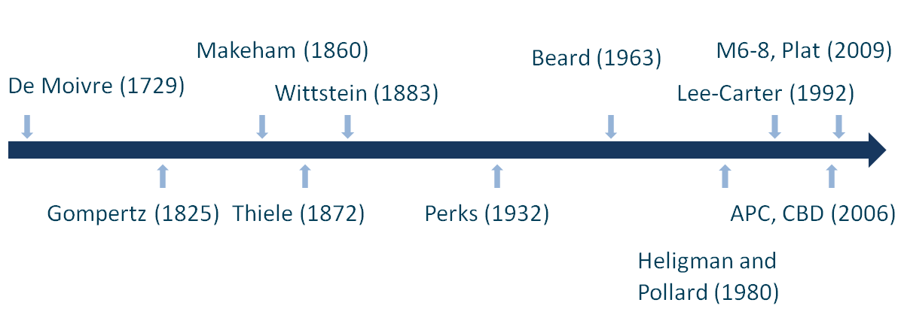
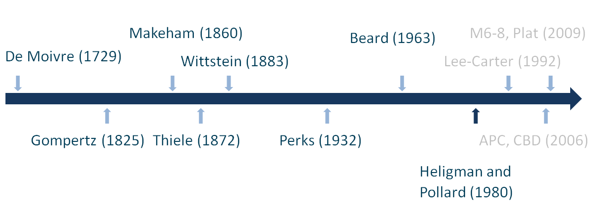
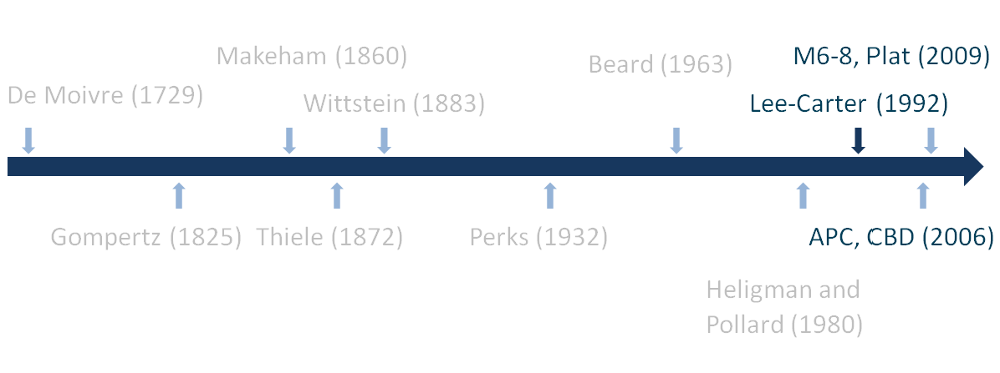
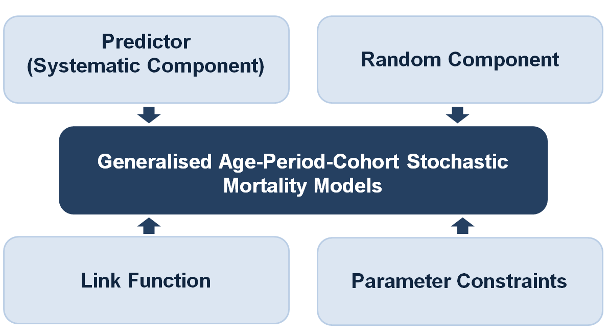
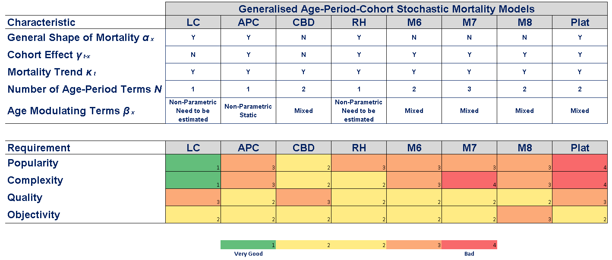

```{r, echo=FALSE}
source("credentials.R")
```

## Agenda

* Introduction to R

* Mortality Overview

* Mortality Models
    * Classical
    * Stochastic
    
* Workshop: Stochastic Mortality Models in R
    * Models Fitting
    * Mortality Projection - Forecasting
    * Portfolio Analysis of BEL and SCR

* Case Studies


## What is R?

<div align="center"><iframe width="560" height="315" src="http://www.youtube.com/embed/TR2bHSJ_eck" frameborder="0" allowfullscreen></iframe></div>

## R Highlights 

* <b>Free, open source, community</b> based statistical software and programming language
* Main usage: Statistical and numerical computing, Data Analysis, Data Visualisation
* Under GNU GPL (General Public License) allowing commercial usage
* Power of R in its <b>packages</b>
* Enterprise version - Revolution Analytics (Microsoft)

<b>“Everything that exists [in R] is an object. Everything that happens [in R] is a function call.”</b> - John Chambers

## RStudio {.smaller}

<b>Most popular Environment to run R</b>

<div align="center">

<p>
http://www.rstudio.com/products/rstudio/
<p>
Free & Open-Source Integrated Development Environment (IDE) for R
<p></div>
<b>Features:</b>

  1. Built-in R console
  2. R, LaTeX, HTML, C++ syntax highlighting, R code completion
  3. Easy management of multiple projects
  4. Integrated R documentation
  5. Interactive debugger
  6. Package development tools
  

Note: R must be installed first!

## Playing with R {.build}

Type in the interactive console:
```{r, eval=FALSE}
3 + 3
```
```{r, echo=F}
3 + 3
```

```{r, eval=FALSE}
getwd()
```

```{r, echo=FALSE}
getwd()
```

```{r, eval=FALSE}
1:10
```

```{r, echo=FALSE}
1:10
```

## Playing with R {.build}

Type in the interactive console:

```{r, eval=FALSE}
x <- 1:10 # "name <- value returns the value invisibly"
```
```{r, eval=FALSE}
x
```

```{r, echo=FALSE}
x <- 1:10 # "name <- value returns the value invisibly"
x
```

```{r, eval=FALSE}
(x <- 1:10) # creates x and prints it
```

```{r, echo=FALSE}
(x <- 1:10)
```

## Operations in R

<div align="center">
`x + y` addition

`x - y` substraction

`x * y` multiplication

`x / y` division

`x ^ y` exponention

`x %% y` devision remainder

`x %/% y` integer division
</div>

<p>
numeric vector `operator` numeric vector --> numeric vector

## Vectors {.build}

```{r}
(x <- 11:20) # exemplary vector
x[1] # first
x[length(x)] # last element using length function
x[c(1, length(x), 1)] # first, last and first again
```

## Vectors {.build}

```{r}
x[1000] # no such element
x * 3 # multiplication
y <- 1:10
x * y
```

## R in Insurance

* Main focus Non-life
    - fit loss distributions and perform credibility analysis - package <b>actuar</b>
    - estimate loss reserves - package <b>ChainLadder</b>
* Financial analysis
    - packages <b>YieldCurve</b>, <b>termstrc</b>
* Life insurance
    - handle demography data - package <b>demography</b>
    - demography projections - package <b>LifeTables</b>
    - actuarial and financial mathematics - package <b>lifecontingencies</b>
    - Life models - packages <b>ilc</b>, <b>LifeMetrics</b>, <b>StMoMo</b>

## <font color="white">.</font>
<center><font size="72"><b>Mortality Overview</b></font></center>
    
## Mortality Overview {.smaller}
Basic quantities in the analysis of mortality

* Survival function

$s_{x} = Pr (X > x)$

* Probability that (x) will survive for another t

$p_{xt} = s_{x+t}/s_{x}$

* Probability that (x) will die within t years

$q_{xt} = [s_{x} - s_{x+t}]/s_{x}$
			
* Mortality intensity (hazard function or force of mortality)

$\mu_{x} = lim_{h \to 0} 1/h * q_{xh}$

Probability that (x) will die within h

## Mortality Features

```{r, echo=FALSE, warning=FALSE, message=FALSE}
## Load required libraries
library(demography)
library(ggplot2)
library(gridExtra)
library(reshape2)

#skDemo<-hmd.mx("NLD", username=username, password=password)
load("Case_study/nlDemo.RData")
years <- 1950:2012
ages<- skDemo$age
Dxt <- skDemo$rate[[3]] * skDemo$pop[[3]]
E0xt <- skDemo$pop[[3]] + 0.5 * Dxt
Ecxt <- skDemo$pop[[3]]
Dxt <- Dxt[,as.character(1950:2012)]
E0xt <- E0xt[,as.character(1950:2012)]
qxt <- log(Dxt/E0xt)

# get data
forecastTime <- 120
ages.fit <- 45:90
```

```{r, echo=FALSE, warning=FALSE, message=FALSE}
## Plots
plot_df    <- data.frame(ages=0:90, qxt[1:91, ncol(qxt)])
ncols <- ncol(plot_df)
plot_df <- melt(plot_df, id="ages")
plot_q <- ggplot(plot_df, aes(x=ages, y=value, colour=variable)) +
  scale_color_manual(values=c("#FF0051")) +
  geom_line(na.rm=TRUE, alpha=1, size=0.8) + theme_minimal() +
  xlab("Ages") + ylab("Observed log mortality rates") + ggtitle("Dutch mortality rates 2012") +
  theme(panel.grid.major.x=element_blank(), axis.line = element_line(colour = "black", size =0.2), legend.position="none",
        axis.title.x=element_text(family="sans",size=rel(1)),
        axis.title.y=element_text(family="sans",size=rel(1), angle=90), plot.title = element_text(family="sans", size=20, face="bold", vjust=2))+
  scale_x_continuous(breaks=seq(0,90, by = 10))+
  coord_cartesian(ylim = c(-10, -0.8))

plot_q

```

## Mortality Features

```{r, echo=FALSE, warning=FALSE, message=FALSE, cache = TRUE}
plot_df    <- data.frame(ages=0:90, qxt[1:91, ncol(qxt)])
ncols <- ncol(plot_df)
plot_df <- melt(plot_df, id="ages")
plot_q <- ggplot(plot_df, aes(x=ages, y=value, colour=variable)) +
  scale_color_manual(values=c("#FF0051")) +
  annotate("text", x=20, y=-6, label= "Very high mortality just after birth", size = 3.5) + 
  geom_line(na.rm=TRUE, alpha=1, size=0.8) + theme_minimal() +
  xlab("Ages") + ylab("Observed log mortality rates") + ggtitle("Dutch mortality rates 2012") +
  theme(panel.grid.major.x=element_blank(), axis.line = element_line(colour = "black", size =0.2), legend.position="none",
        axis.title.x=element_text(family="sans",size=rel(1)),
        axis.title.y=element_text(family="sans",size=rel(1), angle=90), plot.title = element_text(family="sans", size=20, face="bold", vjust=2))+
  scale_x_continuous(breaks=seq(0,90, by = 10))+
  coord_cartesian(ylim = c(-10, -0.8)) 

plot_q
```

## Mortality Features

```{r, echo=FALSE, warning=FALSE, message=FALSE, cache = TRUE}
plot_df    <- data.frame(ages=0:90, qxt[1:91, ncol(qxt)])
ncols <- ncol(plot_df)
plot_df <- melt(plot_df, id="ages")
plot_q <- ggplot(plot_df, aes(x=ages, y=value, colour=variable)) +
  scale_color_manual(values=c("#FF0051")) +
  annotate("text", x=23, y=-7, label= "Accident hump", size = 3.5) + 
  geom_line(na.rm=TRUE, alpha=1, size=0.8) + theme_minimal() +
  xlab("Ages") + ylab("Observed log mortality rates") + ggtitle("Dutch mortality rates 2012") +
  theme(panel.grid.major.x=element_blank(), axis.line = element_line(colour = "black", size =0.2), legend.position="none",
        axis.title.x=element_text(family="sans",size=rel(1)),
        axis.title.y=element_text(family="sans",size=rel(1), angle=90), plot.title = element_text(family="sans", size=20, face="bold", vjust=2))+
  scale_x_continuous(breaks=seq(0,90, by = 10))+
  coord_cartesian(ylim = c(-10, -0.8)) 

plot_q
```

## Mortality Features

```{r, echo=FALSE, warning=FALSE, message=FALSE, cache = TRUE}
plot_df    <- data.frame(ages=0:90, qxt[1:91, ncol(qxt)])
ncols <- ncol(plot_df)
plot_df <- melt(plot_df, id="ages")
plot_q <- ggplot(plot_df, aes(x=ages, y=value, colour=variable)) +
  scale_color_manual(values=c("#FF0051")) +
  annotate("text", x=60, y=-2, label= "Steep increase in mortality", size = 3.5) + 
  geom_line(na.rm=TRUE, alpha=1, size=0.8) + theme_minimal() +
  xlab("Ages") + ylab("Observed log mortality rates") + ggtitle("Dutch mortality rates 2012") +
  theme(panel.grid.major.x=element_blank(), axis.line = element_line(colour = "black", size =0.2), legend.position="none",
        axis.title.x=element_text(family="sans",size=rel(1)),
        axis.title.y=element_text(family="sans",size=rel(1), angle=90), plot.title = element_text(family="sans", size=20, face="bold", vjust=2))+
  scale_x_continuous(breaks=seq(0,90, by = 10))+
  coord_cartesian(ylim = c(-10, -0.8)) 

plot_q
```

## <font color="white">.</font>
<center><font size="72"><b>Mortality Models</b></font></center>

## Mortality Models



## Classic Models



## Classic Models {.smaller}

<b>Some special parametric laws of mortality</b>

* De Moivre

$\mu_{x} = 1/ (ω – x)$ subject to $0 \leq x < ω$

* Gompertz

$\mu_{x} = Bc^{x}$ subject to $x \geq 0, B>0, c>1$

* Makeham

$\mu_{x} = A + Bc^{x}$ subject to $x \geq 0, B>0, c>1, A>=-B$

* Thiele

$\mu_{x} = B_{1}C_{1}^{-x}+B_{2}C_{2}^{[-1/2(x-k)^2]}+B_{3}C_{3}^{x}$ subject to $x\geq 0, B_{1}, B_{2}, B_{3}>0, C_{1}, C_{2}, C_{3}>1$

## Classic Models

<b>Advantages:</b>

+ Compact, small numbers of parameters
+ Highly interpretable
+ Good for comparative work

<b>Disadvantages:</b>

- Almost certainly “wrong”
- Too simplistic
- Struggle with a new source of mortality

## Stochastic Models



## Stochastic Models



## Predictor

```{r, echo=FALSE, warning=FALSE, message=FALSE}
## Plots
plot_df    <- data.frame(ages=0:90, qxt[1:91,1])
ncols <- ncol(plot_df)
plot_df <- melt(plot_df, id="ages")
plot_q <- ggplot(plot_df, aes(x=ages, y=value, colour=variable)) +
  scale_color_manual(values=c("#7F0028")) +
  geom_line(na.rm=TRUE, alpha=1, size=0.8) + theme_minimal() +
  xlab("Ages") + ylab("Observed log mortality rates") + ggtitle("Dutch mortality rates 1950") +
  theme(panel.grid.major.x=element_blank(), axis.line = element_line(colour = "black", size =0.2), legend.position="none", axis.title.x=element_text(family="sans",size=rel(1)),
        axis.title.y=element_text(family="sans",size=rel(1), angle=90), plot.title = element_text(family="sans", size=20, face="bold", vjust=2))+

  scale_x_continuous(breaks=seq(0,90, by = 10))+
  coord_cartesian(ylim = c(-10, -0.8)) 

plot_q

```

## Predictor

```{r, echo=FALSE, warning=FALSE, message=FALSE}
## Plots
plot_df    <- data.frame(ages=0:90, qxt[1:91,1:2])
ncols <- ncol(plot_df)
plot_df <- melt(plot_df, id="ages")
plot_q <- ggplot(plot_df, aes(x=ages, y=value, colour=variable)) +
  scale_color_manual(values=c(rep("#FF0051", 1), "#7F0028")) +
  geom_line(na.rm=TRUE, alpha=1, size=0.8) + theme_minimal() +
  xlab("Ages") + ylab("Observed log mortality rates") + ggtitle("Dutch mortality rates 1951") +
  theme(panel.grid.major.x=element_blank(), axis.line = element_line(colour = "black", size =0.5), legend.position="none",
        axis.title.x=element_text(family="sans",size=rel(1)),
        axis.title.y=element_text(family="sans",size=rel(1), angle=90), plot.title = element_text(family="sans", size=20, face="bold", vjust=2))+
  scale_x_continuous(breaks=seq(0,90, by = 10))+
  coord_cartesian(ylim = c(-10, -0.8)) 

plot_q

```

## Predictor

```{r, echo=FALSE, warning=FALSE, message=FALSE}
## Plots
plot_df    <- data.frame(ages=0:90, qxt[1:91,1:3])
ncols <- ncol(plot_df)
plot_df <- melt(plot_df, id="ages")
plot_q <- ggplot(plot_df, aes(x=ages, y=value, colour=variable)) +
  scale_color_manual(values=c(rep("#FF0051", 2), "#7F0028")) +
  geom_line(na.rm=TRUE, alpha=1, size=0.8) + theme_minimal() +
  xlab("Ages") + ylab("Observed log mortality rates") + ggtitle("Dutch mortality rates 1952") +
  theme(panel.grid.major.x=element_blank(), axis.line = element_line(colour = "black", size =0.2), legend.position="none",
        axis.title.x=element_text(family="sans",size=rel(1)),
        axis.title.y=element_text(family="sans",size=rel(1), angle=90), plot.title = element_text(family="sans", size=20, face="bold", vjust=2))+
  scale_x_continuous(breaks=seq(0,90, by = 10))+
  coord_cartesian(ylim = c(-10, -0.8)) 

plot_q

```

## Predictor

```{r, echo=FALSE, warning=FALSE, message=FALSE}
## Plots
plot_df    <- data.frame(ages=0:90, qxt[1:91,1:4])
ncols <- ncol(plot_df)
plot_df <- melt(plot_df, id="ages")
plot_q <- ggplot(plot_df, aes(x=ages, y=value, colour=variable)) +
  scale_color_manual(values=c(rep("#FF0051", 3), "#7F0028")) +
  geom_line(na.rm=TRUE, alpha=1, size=0.8) + theme_minimal() +
  xlab("Ages") + ylab("Observed log mortality rates") + ggtitle("Dutch mortality rates 1953") +
  theme(panel.grid.major.x=element_blank(), axis.line = element_line(colour = "black", size =0.2), legend.position="none",
        axis.title.x=element_text(family="sans",size=rel(1)),
        axis.title.y=element_text(family="sans",size=rel(1), angle=90), plot.title = element_text(family="sans", size=20, face="bold", vjust=2))+
  scale_x_continuous(breaks=seq(0,90, by = 10))+
  coord_cartesian(ylim = c(-10, -0.8)) 

plot_q

```

## Predictor

```{r, echo=FALSE, warning=FALSE, message=FALSE}
## Plots
plot_df    <- data.frame(ages=0:90, qxt[1:91,1:5])
ncols <- ncol(plot_df)
plot_df <- melt(plot_df, id="ages")
plot_q <- ggplot(plot_df, aes(x=ages, y=value, colour=variable)) +
  scale_color_manual(values=c(rep("#FF0051", 4), "#7F0028")) +
  geom_line(na.rm=TRUE, alpha=1, size=0.8) + theme_minimal() +
  xlab("Ages") + ylab("Observed log mortality rates") + ggtitle("Dutch mortality rates 1954") +
  theme(panel.grid.major.x=element_blank(), axis.line = element_line(colour = "black", size =0.2), legend.position="none",
        axis.title.x=element_text(family="sans",size=rel(1)),
        axis.title.y=element_text(family="sans",size=rel(1), angle=90), plot.title = element_text(family="sans", size=20, face="bold", vjust=2))+
  scale_x_continuous(breaks=seq(0,90, by = 10))+
  coord_cartesian(ylim = c(-10, -0.8)) 

plot_q

```

## Predictor

```{r, echo=FALSE, warning=FALSE, message=FALSE}
## Plots
plot_df    <- data.frame(ages=0:90, qxt[1:91,1:6])
ncols <- ncol(plot_df)
plot_df <- melt(plot_df, id="ages")
plot_q <- ggplot(plot_df, aes(x=ages, y=value, colour=variable)) +
  scale_color_manual(values=c(rep("#FF0051", 5), "#7F0028")) +
  geom_line(na.rm=TRUE, alpha=1, size=0.8) + theme_minimal() +
  xlab("Ages") + ylab("Observed log mortality rates") + ggtitle("Dutch mortality rates 1955") +
  theme(panel.grid.major.x=element_blank(), axis.line = element_line(colour = "black", size =0.2), legend.position="none",
        axis.title.x=element_text(family="sans",size=rel(1)),
        axis.title.y=element_text(family="sans",size=rel(1), angle=90), plot.title = element_text(family="sans", size=20, face="bold", vjust=2))+
  scale_x_continuous(breaks=seq(0,90, by = 10))+
  coord_cartesian(ylim = c(-10, -0.8)) 

plot_q

```

## Predictor

```{r, echo=FALSE, warning=FALSE, message=FALSE}
## Plots
plot_df    <- data.frame(ages=0:90, qxt[1:91,1:7])
ncols <- ncol(plot_df)
plot_df <- melt(plot_df, id="ages")
plot_q <- ggplot(plot_df, aes(x=ages, y=value, colour=variable)) +
  scale_color_manual(values=c(rep("#FF0051", 7), "#7F0028")) +
  geom_line(na.rm=TRUE, alpha=1, size=0.8) + theme_minimal() +
  xlab("Ages") + ylab("Observed log mortality rates") + ggtitle("Dutch mortality rates 1956") +
  theme(panel.grid.major.x=element_blank(), axis.line = element_line(colour = "black", size =0.2), legend.position="none",
        axis.title.x=element_text(family="sans",size=rel(1)),
        axis.title.y=element_text(family="sans",size=rel(1), angle=90), plot.title = element_text(family="sans", size=20, face="bold", vjust=2))+
  scale_x_continuous(breaks=seq(0,90, by = 10))+
  coord_cartesian(ylim = c(-10, -0.8)) 

plot_q

```

## Predictor

```{r, echo=FALSE, warning=FALSE, message=FALSE}
## Plots
plot_df    <- data.frame(ages=0:90, qxt[1:91,1:8])
ncols <- ncol(plot_df)
plot_df <- melt(plot_df, id="ages")
plot_q <- ggplot(plot_df, aes(x=ages, y=value, colour=variable)) +
  scale_color_manual(values=c(rep("#FF0051", 7), "#7F0028")) +
  geom_line(na.rm=TRUE, alpha=1, size=0.8) + theme_minimal() +
  xlab("Ages") + ylab("Observed log mortality rates") + ggtitle("Dutch mortality rates 1957") +
  theme(panel.grid.major.x=element_blank(), axis.line = element_line(colour = "black", size =0.2), legend.position="none",
        axis.title.x=element_text(family="sans",size=rel(1)),
        axis.title.y=element_text(family="sans",size=rel(1), angle=90), plot.title = element_text(family="sans", size=20, face="bold", vjust=2))+
  scale_x_continuous(breaks=seq(0,90, by = 10))+
  coord_cartesian(ylim = c(-10, -0.8)) 

plot_q

```

## Predictor

```{r, echo=FALSE, warning=FALSE, message=FALSE}
## Plots
plot_df    <- data.frame(ages=0:90, qxt[1:91,1:9])
ncols <- ncol(plot_df)
plot_df <- melt(plot_df, id="ages")
plot_q <- ggplot(plot_df, aes(x=ages, y=value, colour=variable)) +
  scale_color_manual(values=c(rep("#FF0051", 8), "#7F0028")) +
  geom_line(na.rm=TRUE, alpha=1, size=0.8) + theme_minimal() +
  xlab("Ages") + ylab("Observed log mortality rates") + ggtitle("Dutch mortality rates 1958") +
  theme(panel.grid.major.x=element_blank(), axis.line = element_line(colour = "black", size =0.2), legend.position="none",
        axis.title.x=element_text(family="sans",size=rel(1)),
        axis.title.y=element_text(family="sans",size=rel(1), angle=90), plot.title = element_text(family="sans", size=20, face="bold", vjust=2))+
  scale_x_continuous(breaks=seq(0,90, by = 10))+
  coord_cartesian(ylim = c(-10, -0.8)) 

plot_q

```

## Predictor

```{r, echo=FALSE, warning=FALSE, message=FALSE}
## Plots
plot_df    <- data.frame(ages=0:90, qxt[1:91,1:10])
ncols <- ncol(plot_df)
plot_df <- melt(plot_df, id="ages")
plot_q <- ggplot(plot_df, aes(x=ages, y=value, colour=variable)) +
  scale_color_manual(values=c(rep("#FF0051", 9), "#7F0028")) +
  geom_line(na.rm=TRUE, alpha=1, size=0.8) + theme_minimal() +
  xlab("Ages") + ylab("Observed log mortality rates") + ggtitle("Dutch mortality rates 1959") +
  theme(panel.grid.major.x=element_blank(), axis.line = element_line(colour = "black", size =0.2), legend.position="none",
        axis.title.x=element_text(family="sans",size=rel(1)),
        axis.title.y=element_text(family="sans",size=rel(1), angle=90), plot.title = element_text(family="sans", size=20, face="bold", vjust=2))+
  scale_x_continuous(breaks=seq(0,90, by = 10))+
  coord_cartesian(ylim = c(-10, -0.8)) 

plot_q

```

## Predictor

```{r, echo=FALSE, warning=FALSE, message=FALSE}
## Plots
plot_df    <- data.frame(ages=0:90, qxt[1:91,1:11])
ncols <- ncol(plot_df)
plot_df <- melt(plot_df, id="ages")
plot_q <- ggplot(plot_df, aes(x=ages, y=value, colour=variable)) +
  scale_color_manual(values=c(rep("#FF0051", 10), "#7F0028")) +
  geom_line(na.rm=TRUE, alpha=1, size=0.8) + theme_minimal() +
  xlab("Ages") + ylab("Observed log mortality rates") + ggtitle("Dutch mortality rates 1960") +
  theme(panel.grid.major.x=element_blank(), axis.line = element_line(colour = "black", size =0.2), legend.position="none",
        axis.title.x=element_text(family="sans",size=rel(1)),
        axis.title.y=element_text(family="sans",size=rel(1), angle=90), plot.title = element_text(family="sans", size=20, face="bold", vjust=2))+
  scale_x_continuous(breaks=seq(0,90, by = 10))+
  coord_cartesian(ylim = c(-10, -0.8)) 

plot_q

```

## Predictor

```{r, echo=FALSE, warning=FALSE, message=FALSE}
## Plots
plot_df    <- data.frame(ages=0:90, qxt[1:91,1:21])
ncols <- ncol(plot_df)
plot_df <- melt(plot_df, id="ages")
plot_q <- ggplot(plot_df, aes(x=ages, y=value, colour=variable)) +
  scale_color_manual(values=c(rep("#FF0051", 20), "#7F0028")) +
  geom_line(na.rm=TRUE, alpha=1, size=0.8) + theme_minimal() +
  xlab("Ages") + ylab("Observed log mortality rates") + ggtitle("Dutch mortality rates 1970") +
  theme(panel.grid.major.x=element_blank(), axis.line = element_line(colour = "black", size =0.2), legend.position="none",
        axis.title.x=element_text(family="sans",size=rel(1)),
        axis.title.y=element_text(family="sans",size=rel(1), angle=90), plot.title = element_text(family="sans", size=20, face="bold", vjust=2))+
  scale_x_continuous(breaks=seq(0,90, by = 10))+
  coord_cartesian(ylim = c(-10, -0.8)) 

plot_q

```

## Predictor

```{r, echo=FALSE, warning=FALSE, message=FALSE}
## Plots
plot_df    <- data.frame(ages=0:90, qxt[1:91,1:31])
ncols <- ncol(plot_df)
plot_df <- melt(plot_df, id="ages")
plot_q <- ggplot(plot_df, aes(x=ages, y=value, colour=variable)) +
  scale_color_manual(values=c(rep("#FF0051", 30), "#7F0028")) +
  geom_line(na.rm=TRUE, alpha=1, size=0.8) + theme_minimal() +
  xlab("Ages") + ylab("Observed log mortality rates") + ggtitle("Dutch mortality rates 1980") +
  theme(panel.grid.major.x=element_blank(), axis.line = element_line(colour = "black", size =0.2), legend.position="none",
        axis.title.x=element_text(family="sans",size=rel(1)),
        axis.title.y=element_text(family="sans",size=rel(1), angle=90), plot.title = element_text(family="sans", size=20, face="bold", vjust=2))+
  scale_x_continuous(breaks=seq(0,90, by = 10))+
  coord_cartesian(ylim = c(-10, -0.8)) 

plot_q

```

## Predictor

```{r, echo=FALSE, warning=FALSE, message=FALSE}
## Plots
plot_df    <- data.frame(ages=0:90, qxt[1:91,1:41])
ncols <- ncol(plot_df)
plot_df <- melt(plot_df, id="ages")
plot_q <- ggplot(plot_df, aes(x=ages, y=value, colour=variable)) +
  scale_color_manual(values=c(rep("#FF0051", 40), "#7F0028")) +
  geom_line(na.rm=TRUE, alpha=1, size=0.8) + theme_minimal() +
  xlab("Ages") + ylab("Observed log mortality rates") + ggtitle("Dutch mortality rates 1990") +
  theme(panel.grid.major.x=element_blank(), axis.line = element_line(colour = "black", size =0.2), legend.position="none",
        axis.title.x=element_text(family="sans",size=rel(1)),
        axis.title.y=element_text(family="sans",size=rel(1), angle=90), plot.title = element_text(family="sans", size=20, face="bold", vjust=2))+
  scale_x_continuous(breaks=seq(0,90, by = 10))+
  coord_cartesian(ylim = c(-10, -0.8)) 

plot_q

```

## Predictor

```{r, echo=FALSE, warning=FALSE}
## Plots
plot_df    <- data.frame(ages=0:90, qxt[1:91,1:51])
ncols <- ncol(plot_df)
plot_df <- melt(plot_df, id="ages")
plot_q <- ggplot(plot_df, aes(x=ages, y=value, colour=variable)) +
  scale_color_manual(values=c(rep("#FF0051", 50), "#7F0028")) +
  geom_line(na.rm=TRUE, alpha=1, size=0.8) + theme_minimal() +
  xlab("Ages") + ylab("Observed log mortality rates") + ggtitle("Dutch mortality rates 2000") +
  theme(panel.grid.major.x=element_blank(), axis.line = element_line(colour = "black", size =0.2), legend.position="none",
        axis.title.x=element_text(family="sans",size=rel(1)),
        axis.title.y=element_text(family="sans",size=rel(1), angle=90), plot.title = element_text(family="sans", size=20, face="bold", vjust=2))+
  scale_x_continuous(breaks=seq(0,90, by = 10))+
  coord_cartesian(ylim = c(-10, -0.8)) 

plot_q

```

## Predictor
```{r, echo=FALSE, warning=FALSE, message=FALSE}
## Plots
plot_df    <- data.frame(ages=0:90, qxt[1:91,])
ncols <- ncol(plot_df)
plot_df <- melt(plot_df, id="ages")
plot_q <- ggplot(plot_df, aes(x=ages, y=value, colour=variable)) +
  scale_color_manual(values=c(rep("#FF0051", (ncol(qxt)-1)), "#7F0028")) +
  geom_line(na.rm=TRUE, alpha=1, size=0.8) + theme_minimal() +
  xlab("Ages") + ylab("Observed log mortality rates") + ggtitle("Dutch mortality rates 2012") +
  theme(panel.grid.major.x=element_blank(), axis.line = element_line(colour = "black", size =0.2), legend.position="none",
        axis.title.x=element_text(family="sans",size=rel(1)),
        axis.title.y=element_text(family="sans",size=rel(1), angle=90), plot.title = element_text(family="sans", size=20, face="bold", vjust=2))+
  scale_x_continuous(breaks=seq(0,90, by = 10))+
  coord_cartesian(ylim = c(-10, -0.8)) 

plot_q
```

## Predictor

```{r, echo=FALSE, warning=FALSE, message=FALSE}
## Plots
plot_df    <- data.frame(ages=0:90, qxt[1:91,])
ncols <- ncol(plot_df)
plot_df <- melt(plot_df, id="ages")
plot_qall <- ggplot(plot_df, aes(x=ages, y=value, colour=variable)) +
  scale_color_manual(values=c(rep("#FF0051", (ncol(qxt)+1)))) +
  geom_line(na.rm=TRUE, alpha=1, size=0.8) + theme_minimal() +
  xlab("Ages") + ylab("Observed log mortality rates") + ggtitle("Dutch mortality rates 1950-2012") +
  theme(panel.grid.major.x=element_blank(), axis.line = element_line(colour = "black", size =0.2), legend.position="none",
        axis.title.x=element_text(family="sans",size=rel(1)),
        axis.title.y=element_text(family="sans",size=rel(1), angle=90), plot.title = element_text(family="sans", size=20, face="bold", vjust=2))+
  scale_x_continuous(breaks=seq(0,90, by = 10))+
  coord_cartesian(ylim = c(-10, -0.8)) 

plot_qall
```

$\hat{\mu}_{x}(t)$

## Predictor

```{r, echo=FALSE, warning=FALSE, message=FALSE}
## Plots
plot_df    <- data.frame(ages=0:90, qxt[1:91,], average=rowMeans(qxt[1:91,], na.rm=F))
ncols <- ncol(plot_df)
plot_df <- melt(plot_df, id="ages")
plot_q <- ggplot(plot_df, aes(x=ages, y=value, colour=variable)) +
  scale_color_manual(values=c(rep("#FF0051", (ncol(qxt))), "#7F0028")) +
  scale_linetype_manual(values = c(rep(1,ncol(qxt)), 2)) +
  geom_line(na.rm=TRUE, alpha=1, size=0.8, aes(linetype=variable)) + 
  theme_minimal() +
  xlab("Ages") + ylab("Observed log mortality rates") + ggtitle("Dutch mortality rates 1950-2012") +
  theme(panel.grid.major.x=element_blank(), axis.line = element_line(colour = "black", size =0.2), legend.position="none",
        axis.title.x=element_text(family="sans",size=rel(1)),
        axis.title.y=element_text(family="sans",size=rel(1), angle=90), plot.title = element_text(family="sans", size=20, face="bold", vjust=2))+
  scale_x_continuous(breaks=seq(0,90, by = 10))+
  coord_cartesian(ylim = c(-10, -0.8)) 

plot_q
```

$\hat{\mu}_{x}(t) = \alpha_{x}$

## Predictor

```{r, echo=FALSE, warning=FALSE, message=FALSE, cache=TRUE}
plot_qall
```

$\hat{\mu}_{x}(t) = \alpha_{x} + \kappa_{t}$

## Predictor

```{r, echo=FALSE, cache=TRUE}
plot_qall
```

$\hat{\mu}_{x}(t) = \alpha_{x} + \beta_{x} \kappa_{t}$

## Predictor

```{r, echo=FALSE, cache = TRUE}
plot_qall
```

$\hat{\mu}_{x}(t) = \alpha_{x} + \sum^{N}_{i=1} \beta^{i}_{x} \kappa^{i}_{t}$ <font size="4">$N$ - number of age-period terms</font>

## Predictor

```{r, echo=FALSE}
## Plots
disturb <- c(rep(0,10),-0.25, 0.3, rep(0, 8), -0.2, 0.3, rep(0,8), -0.2, 0.3, rep(0,8), -0.3, 0.2, rep(0,15), -0.2, 0.2, -0.2, rep(0,27), -0.2, 0.2, 0,0)
plot_df    <- data.frame(ages=0:90, qxt[1:91,], average=rowMeans(qxt[1:91,], na.rm=F)+ disturb)
ncols <- ncol(plot_df)
plot_df <- melt(plot_df, id="ages")
plot_q <- ggplot(plot_df, aes(x=ages, y=value, colour=variable)) +
  scale_color_manual(values=c(rep("#FF0051", ncol(qxt)), "#7F0028")) +
  scale_linetype_manual(values = c(rep(1,ncol(qxt)), 2)) +
  geom_line(na.rm=TRUE, alpha=1, aes(linetype=variable, size=variable)) +
  scale_size_manual(values = c(rep(0.8, ncol(qxt)), 0.8)) +
  theme_minimal() +
  xlab("Ages") + ylab("Observed log mortality rates") + ggtitle("Dutch mortality rates 1950-2012") +
  theme(panel.grid.major.x=element_blank(), axis.line = element_line(colour = "black", size =0.2), legend.position="none",
        axis.title.x=element_text(family="sans",size=rel(1)),
        axis.title.y=element_text(family="sans",size=rel(1), angle=90), plot.title = element_text(family="sans", size=20, face="bold", vjust=2))+
  scale_x_continuous(breaks=seq(0,90, by = 10))+
  coord_cartesian(ylim = c(-10, -0.8)) 

plot_q
```

$\hat{\mu}_{x}(t) = \alpha_{x} + \sum^{N}_{i=1} \beta^{i}_{x} \kappa^{i}_{t} + \gamma_{t-x}$ <font size="4">$N$ - number of age-period terms</font>

## Predictor

```{r, echo=FALSE}
## Plots
disturb <- c(rep(0,10),-0.1, 0.1, rep(0, 8), -0, 0, rep(0,8), -0.2, 0.2, rep(0,8), -0.1, 0.2, rep(0,15), 0, 0, -0.2, rep(0,27), -0.2, 0.2, 0,0)
plot_df    <- data.frame(ages=0:90, qxt[1:91,], average=rowMeans(qxt[1:91,], na.rm=F)+ disturb)
ncols <- ncol(plot_df)
plot_df <- melt(plot_df, id="ages")
plot_q <- ggplot(plot_df, aes(x=ages, y=value, colour=variable)) +
  scale_color_manual(values=c(rep("#FF0051", (ncol(qxt))), "#7F0028")) +
  scale_linetype_manual(values = c(rep(1,ncol(qxt)), 2)) +
   geom_line(na.rm=TRUE, alpha=1, aes(linetype=variable, size=variable)) +
  scale_size_manual(values = c(rep(0.8, ncol(qxt)), 0.8)) +
  theme_minimal() +
  xlab("Ages") + ylab("Observed log mortality rates") + ggtitle("Dutch mortality rates 1950-2012") +
  theme(panel.grid.major.x=element_blank(), axis.line = element_line(colour = "black", size =0.2), legend.position="none",
        axis.title.x=element_text(family="sans",size=rel(1)),
        axis.title.y=element_text(family="sans",size=rel(1), angle=90), plot.title = element_text(family="sans", size=20, face="bold", vjust=2))+
  scale_x_continuous(breaks=seq(0,90, by = 10))+
  coord_cartesian(ylim = c(-10, -0.8)) 

plot_q
```

$\hat{\mu}_{x}(t) = \alpha_{x} + \sum^{N}_{i=1} \beta^{i}_{x} \kappa^{i}_{t} + \beta^{0}_{x} \gamma_{t-x}$ <font size="4">$N$ - number of age-period terms</font>

## Cohort effect

```{r, message=FALSE, warning=FALSE, echo=FALSE}
load("skDemo.RData")
years <- skDemo$year
ages<- skDemo$age
Dxt <- skDemo$rate[[3]] * skDemo$pop[[3]]
E0xt <- skDemo$pop[[3]] + 0.5 * Dxt
Ecxt <- skDemo$pop[[3]]
qxt <- Dxt/E0xt
```

```{r setup, results='asis', echo=FALSE, warning=FALSE}
library(knitr)
library(rgl)
knit_hooks$set(webgl = hook_webgl)
knitr::opts_chunk$set(cache=FALSE)
```
```{R, testgl, webgl=TRUE, echo=FALSE,  fig.height=5, warning=FALSE}
persp3d(ages[0:100], years, log(qxt)[0:100,], col="skyblue", shade=TRUE,xlab="Ages (0-100)",
        ylab="Years",zlab="Mortality rate (log)")
```

## Models Predictor {.smaller}

<b>Generalised Age-Period-Cohort Stochastic Mortality Models</b>

* Lee-Carter (LC) 
<center>$\hat{\mu_{xt}} = \alpha_{x} + \beta^{(1)}_{x} \kappa^{(1)}_{t}$</center>

* Age-Period-Cohort (APC) 
<center>$\hat{\mu_{xt}} = \alpha_{x} + \kappa^{(1)}_{t} +\gamma_{t-x}$</center>

* Cairns-Blake Dowd (CBD) 
<center>$\hat{\mu_{xt}} = \kappa^{(1)}_{t} + (x-\bar{x})\kappa^{(2)}_{t}$</center>

* Renshaw and Haberman (RH) 
<center>$\hat{\mu_{xt}} = \alpha_{x} + \beta^{(1)}_{x} \kappa^{(1)}_{t} + \gamma_{t-x}$</center>

## Models Predictor {.smaller}

<b>Generalised Age-Period-Cohort Stochastic Mortality Models</b>

* Quadratic CBD with cohort effects M6 
<center>$\hat{\mu_{xt}} = \kappa^{(1)}_{t} + (x-\bar{x})\kappa^{(2)}_{t} +\gamma_{t-x}$</center>

* Quadratic CBD with cohort effects M7 
<center>$\hat{\mu_{xt}} = \kappa^{(1)}_{t} + (x-\bar{x})\kappa^{(2)}_{t} + ((x-\bar{x})^2-\hat{\sigma^{2}_{x}}) \kappa^{3}_{t}$</center>

* Quadratic CBD with cohort effects M8 
<center>$\hat{\mu_{xt}} = \kappa^{(1)}_{t} + (x-\bar{x})\kappa^{(2)}_{t} + (x_{c}-x)\gamma_{t-x}$</center>

* Plat 
<center>$\hat{\mu_{t}} = \alpha_{x} + \kappa^{(1)}_{t} + (x-\bar{x})\kappa^{(2)}_{t} + \gamma_{t-x}$</center>

## Model Comparison

<center></center>

## Random Component

The numbers of deaths $D_{xt}$ are independent

$D_{xt}$ follows a Poisson or a Binomial distribution

## Link Function

* Number of link functions possible
* Convenient to use canonical link
    * Log link for Poisson $\hat{\mu}_{xt} = log\mu_{xt}$
    * Logit link for Binomial $\hat{\mu}_{xt} = ln[\mu_{xt}/(1-\mu_{xt})]$


## Parameter Constraints

* Most stochastic mortality models not identifiable up to a transformation

* Therefore parameter constraints required to ensure unique parameter estimates

* Parameter constraints applied through constraint function

## Stochastic Models

Models sensitive to:

* Historical data

* Assumptions made

Good practice

* Understand and validate data

* Understand models and their assumptions

* Test several methods

* Compare and validate results

## <font color="white">.</font>
<center><font size="72"><b>R Workshop</b></font></center>

## Case Study {.small}

* Dutch mortality data from Human Mortality Database

* Look at mortality models: LC, APC, CBD, RH, M6-M8, PLAT
    * Fit models
    * Analyse model fit
    * Project mortalities

* Benchmark against AG table

* BEL and SCR Projection for a portfolio

* Writting own packages in R

## R getting started

* Set working directory <b>Session > Set Working Directory > Choose Directory...</b> or press <b>Ctrl+Shift+H</b> and select the folder or use the console

```{r, eval=F}
setwd('<directory name>') # wrapped in '' 
## for Windows the path uses / instead \
```

## Exercises

* Shock in the portfolio: everybody 5 years younger
* Mortality projection based on shorter historical data: 1989 instead 1950
    * Exclude RH model (problems with convergence)

## References {.smaller}

["StMoMO: An R Package for Stochastic Mortality Modelling"](https://cran.r-project.org/web/packages/StMoMo/vignettes/StMoMoVignette.pdf) A.M. Villegas et al.

["Stochastic Modelling of Mortality Risks"](http://dare.uva.nl/cgi/arno/show.cgi?fid=22881) Frankie Gregorkiewicz

["Solvency II Glossary"](http://ec.europa.eu/internal_market/insurance/docs/solvency/impactassess/annex-c08d_en.pdf) CEA and the Groupe Consultatif

["R: The most powerful and most widely used statistical software"](https://www.youtube.com/watch?v=TR2bHSJ_eck&feature=youtu.be) Revolution Analytics


